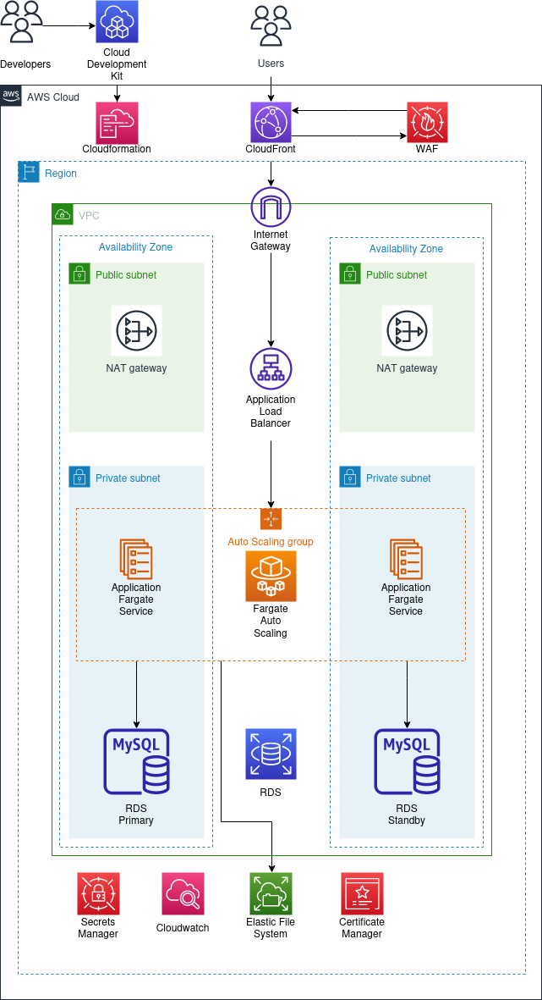

# Development Infrastructure for Moodle LMS

This infrastructure is built with the AWS Cloud Development Kit (CDK) and written in Python.

It has been built using this AWS blog post as a guide: [modernize-moodle-lms-aws-serverless-containers](https://aws.amazon.com/blogs/publicsector/modernize-moodle-lms-aws-serverless-containers/)

## Initial setup for AWS CDK deelopment

 * Full setup details can be found at [AWS CDK Getting Started](https://docs.aws.amazon.com/cdk/v2/guide/getting_started.html)
 * A getting started tutorial from AWS can be found [here](https://aws.amazon.com/getting-started/guides/setup-cdk/)

You will need the following to use the CDK in Python:

 * Python3
 * Node.js and NPM are required to generate and run a CDK application, as per above instructions
 * Install the AWS CDK: `npm install --global aws-cdk`
 * To generate a new project, make and move into a new directory, run: `cdk init app --language python`
 * Activate the virtual environment: `source .venv/bin/activate`
 * Install/upgrade dependencies by running: `python3 -m pip install --upgrade -r requirements.txt`
 * To be able to run tests with pytest run `python3 -m pip install --upgrade -r requirements-dev.txt`
 * The entry point for the app will be: `./app.py`

## To work with the lastest code in this repo
 * Make sure you have completed the initial setup steps
 * Clone the repo `git clone https://github.com/Scottish-Tech-Army/LMS.git`
 * Move into the cloned directory ` cd LMS`
 * Best to make a local development branch `git switch -c nameofyouruniquebranch`
 * Move into the infrastructure directory, where the cdk code is kept `cd Moodle`
 * Create a virtual environment as .venv `python -m venv .venv`
 * Activate the virtual environment with `source .venv/bin/activate`
 * Install/upgrade dependencies by running: `python3 -m pip install --upgrade -r requirements.txt`
 * To be able to run tests with pytest also run `python3 -m pip install --upgrade -r requirements-dev.txt`
 * Continue to Development below

## Development

To get started with development:

 * Activate the virtual environment if it is not already active `source .venv/bin/activate`
 * Edit infrastructure code
 * Login to AWS and copy CLI credentials into terminal for correct deployment account (lms-stag-prod)
 * Check current logged in account, region and deployment status of stacks with `python3 list_stacks.py`
 * Obtain Moodle admin username and password in deployed stacks with `python3 list_stacks.py`
 * List stacks available in the cdk code with `cdk ls` (compare with already deployed stacks above)
 * Synthesise the CloudFormation template with `cdk synth nameofstack` for stacks not yet deployed
 * Check differences to be deployed by running: `cdk diff nameofstack` for stacks already deployed
 * Deploy infrastructure changes by running `cdk deploy nameofstack`

## Tidy Up when you have finished
 * Destroy the deployed app with `cdk destroy nameofstack` in development to avoid extra costs
 * Deactivate the vitual environment `deactivate`

NB you will need to have AWS credentials to run `cdk deploy`

## Useful commands

 * `cdk ls`          list all stacks in the app
 * `cdk synth`       emits the synthesized CloudFormation template
 * `cdk deploy`      deploy this stack to your default AWS account/region
 * `cdk diff`        compare deployed stack with current state
 * `cdk docs`        open CDK documentation

## I drew a picture with [https://app.diagrams.net/?splash=0&libs=aws4](https://app.diagrams.net/?splash=0&libs=aws4)

